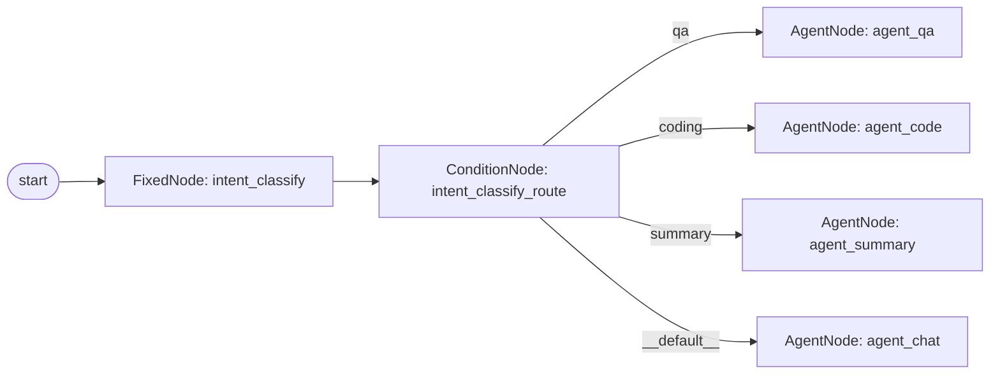
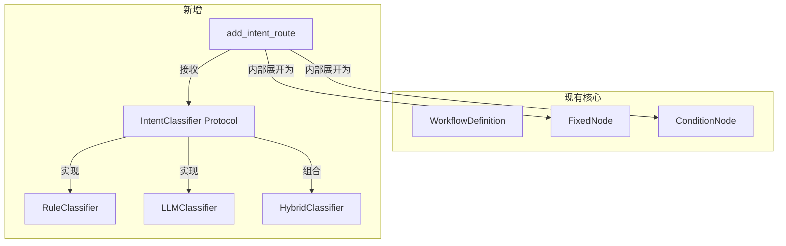

# Intent Routing — WorkflowLoop 意图路由方案

> ⚠️ **本文档是 `loop-strategy-design.md` 的子文档**。
> 阅读前请确保已理解主文档中的 **WorkflowLoop**（§2.3）、**WorkflowNode 三种节点类型** 和 **ConditionNode 分支机制**。
>
> 主文档 [`loop-strategy-design.md`](loop-strategy-design.md) → §2.3 WorkflowLoop → §2.3.1 运行时图遍历
> 关联文档：[`agent-runtime-design.md`](agent-runtime-design.md) — §2 Router 原语、§6 ContextPayload
> 关联文档：[`orchestration-components-design.md`](orchestration-components-design.md) — 编排组件设计模式

## 编码规范

本文档涉及的所有代码实现必须遵循以下质量要求：

### 注释
- `WorkflowDefinition.add_intent_route()` 必须包含完整的**中文 docstring**，说明参数、返回值、内部展开逻辑
- `IntentClassifier` 协议必须包含 **Protocol docstring** 说明接口语义
- 所有内置分类器类（Rule / LLM / Hybrid）必须包含类级别的**中文注释**说明适用场景

### 测试
- 完整的**单元测试**：`add_intent_route()` 内部展开验证（3 种：正常路由/未匹配降级/分类器抛异常）
- **端到端测试**：`WorkflowLoop.run()` 真实执行意图路由全链路
- 测试通过率：**100%**，覆盖率：**≥96%**（含分支覆盖）

### Lint
- **ruff** 零报错 + **Pylance** strict 模式零报错

### 类型标注
- `IntentClassifier` 协议必须标注精确的输入输出类型
- 禁止使用 `Any`；`classifier` 参数的类型应为 `Callable[[RuntimeContext], Awaitable[str]]` 而非裸 `Callable`

---

## 一、问题

### 1.1 当前 WorkflowLoop 的节点体系

`WorkflowLoop` 目前有三种节点类型：

| 节点 | 职责 | 行为 |
|------|------|------|
| `FixedNode` | 确定性逻辑 | 执行预定义 handler，返回任意结果 |
| `AgentNode` | LLM 决策 | 使用 StepRunner 执行一次 LLM + 工具调用 |
| `ConditionNode` | 条件分支 | 根据 condition_fn 返回值选择后续路径 |

意图识别可以用 `FixedNode + ConditionNode` 组合实现：

```python
wf.add_node(FixedNode("classify", handler=classify_intent))
wf.add_node(ConditionNode("route", condition_fn=lambda ctx: ctx.services["_intent"]))
wf.add_condition("route", {"qa": "agent_qa", "coding": "agent_code"})
wf.add_edge("classify", "route")
```

### 1.2 组合方式的痛点

1. **语义不内聚**：分类逻辑在 FixedNode，分支映射在 add_condition，边在 add_edge——意图路由的完整语义分散在三处
2. **样板代码多**：每次写意图路由都要重复 4 步（add_node x2 + add_condition + add_edge）
3. **无默认行为**：未匹配的 intent 没有内置的 fallback 机制（用户需在 condition_fn 中自行处理）
4. **无内置结果缓存**：多节点消费同一个分类结果时，需通过 `ctx.services` 传递，无标准化机制

---

## 二、设计目标

| # | 目标 | 说明 |
|---|------|------|
| 1 | **声明式 API** | 一个调用完成意图路由的配置，内部自动展开为节点组合 |
| 2 | **语义内聚** | 分类逻辑、分支映射、降级策略在同一处声明 |
| 3 | **零侵入** | 不修改 `WorkflowLoop.run()` 的执行引擎，不新增节点类型 |
| 4 | **可扩展** | 支持任意分类器实现（规则/LLM/嵌入向量），不绑定具体后端 |
| 5 | **可序列化** | `to_dict()`/`from_dict()` 支持意图路由配置的导入导出 |

---

## 三、方案设计

### 3.1 核心抽象：IntentClassifier 协议

```python
# src/intent/_protocols.py（新增文件）

class IntentClassifier(Protocol):
    """
    意图分类器协议。

    任何实现了 classify 方法的对象都是 IntentClassifier。
    输入用户消息上下文，输出意图名称字符串。
    未匹配时返回约定的默认意图（如 "chat"）。
    """
    async def classify(self, ctx: RuntimeContext) -> str: ...
```

> **为什么是 `(ctx) → str` 而不是 `(query) → str`？**
> 因为有些分类器可能需要额外的上下文（对话历史、用户画像、当前 step 状态）来做判断。
> 只传 query 会限制分类器的信息获取能力。

### 3.2 WorkflowDefinition 新增：`add_intent_route()`

```python
class WorkflowDefinition:
    # ── 新增方法 ──

    def add_intent_route(
        self,
        classifier: Callable[[RuntimeContext], Awaitable[str]],
        routes: dict[str, str],
        default: str = "",
        node_id: str = "intent_classify",
    ) -> WorkflowDefinition:
        ...
```

**内部展开逻辑**：

```python
def add_intent_route(self, classifier, routes, default="", node_id="intent_classify"):
    classify_id = node_id
    route_id = f"{node_id}_route"
    all_routes = dict(routes)

    # 步骤 1：创建分类节点（FixedNode）
    # 执行分类器，将结果存入 ctx.services["_intent_result"]
    async def _classify(ctx):
        result = await classifier(ctx)
        ctx.services["_intent_result"] = result
        return result

    self.add_node(FixedNode(classify_id, handler=_classify))

    # 步骤 2：创建路由节点（ConditionNode）
    # 从 ctx.services 读取分类结果，走对应分支
    async def _route(ctx):
        return ctx.services.get("_intent_result", "__default__")

    self.add_node(ConditionNode(route_id, condition_fn=_route))

    # 步骤 3：添加边
    self.add_edge(classify_id, route_id)

    # 步骤 4：添加条件分支（含 fallback）
    if default:
        all_routes["__default__"] = default
    self.add_condition(route_id, all_routes)

    return self
```

**展开后的图结构**：



### 3.3 三种内置分类器

分类器作为独立模块，通过 `IntentClassifier` 协议注入：

```python
# ── 方案一：规则匹配 ──

class RuleClassifier:
    """关键词规则匹配——零依赖、O(n) 延迟、适合简单场景"""
    def __init__(self, rules: dict[str, list[str]], default: str = "chat"):
        self._rules = {k: [kw.lower() for kw in v] for k, v in rules.items()}
        self._default = default

    async def classify(self, ctx: RuntimeContext) -> str:
        query = self._get_query(ctx)
        query_lower = query.lower()
        for intent, keywords in self._rules.items():
            if any(kw in query_lower for kw in keywords):
                return intent
        return self._default

    @staticmethod
    def _get_query(ctx: RuntimeContext) -> str:
        for msg in reversed(ctx.messages):
            if isinstance(msg, dict) and msg.get("role") == "user":
                return msg.get("content", "")
        return ""


# ── 方案二：LLM 分类 ──

class LLMClassifier:
    """LLM 分类——灵活、可处理复杂语义，适合生产环境"""
    def __init__(
        self,
        llm: Callable[[str], Awaitable[str]],
        categories: list[str],
        default: str = "chat",
    ):
        self._llm = llm
        self._categories = categories
        self._default = default

    async def classify(self, ctx: RuntimeContext) -> str:
        query = self._get_query(ctx)
        prompt = (
            f"从以下分类中选择最匹配用户意图的一项：\n"
            + "\n".join(f"- {c}" for c in self._categories)
            + f"\n\n用户输入：{query}\n"
            + "只返回分类名称，不要任何额外内容。"
        )
        result = (await self._llm(prompt)).strip().lower()
        return result if result in self._categories else self._default

    @staticmethod
    def _get_query(ctx: RuntimeContext) -> str:
        for msg in reversed(ctx.messages):
            if isinstance(msg, dict) and msg.get("role") == "user":
                return msg.get("content", "")
        return ""


# ── 方案三：混合分类器（推荐）──

class HybridClassifier:
    """
    混合分类器——规则兜底 + LLM 补充。

    规则分类置信度足够高时直接返回，否则走 LLM。
    兼顾低延迟（简单 query 秒回）和高准确率（复杂 query 走 LLM）。
    """
    def __init__(
        self,
        rules: dict[str, list[str]],
        llm: Callable[[str], Awaitable[str]],
        categories: list[str],
        threshold: int = 3,    # 至少匹配 threshold 个关键词才走规则
        default: str = "chat",
    ):
        self._rule = RuleClassifier(rules, default)
        self._llm = LLMClassifier(llm, categories, default)
        self._threshold = threshold
        self._rules = rules

    async def classify(self, ctx: RuntimeContext) -> str:
        # 规则分类
        intent = await self._rule.classify(ctx)

        # 检查匹配强度
        query = self._rule._get_query(ctx).lower()
        matched = sum(1 for kw in self._rules.get(intent, []) if kw in query)

        if matched >= self._threshold:
            return intent

        # 匹配不足，走 LLM
        return await self._llm.classify(ctx)
```

### 3.4 序列化支持

在 `WorkflowDefinition.to_dict()` 中添加意图路由的元信息，确保可完整序列化：

```python
# to_dict() 新增
"intent_routes": [
    {
        "classifier_type": "rule|llm|hybrid",
        "routes": {"qa": "agent_qa", ...},
        "default": "chat_agent",
        "config": {...},       # 分类器的反序列化配置
    }
]
```

> **注意**：分类器的 handler 函数本身不可序列化。`from_dict()` 重建时需要由用户或工厂注入对应的分类器实例。

---

## 四、使用示例

### 4.1 规则分类 + WorkflowLoop

```python
from src.runtime.loops import WorkflowDefinition, WorkflowLoop, AgentNode

classifier = RuleClassifier(
    rules={
        "qa": ["什么", "为什么", "如何", "怎么"],
        "coding": ["代码", "实现", "bug", "函数", "类"],
        "summary": ["总结", "概括", "汇总"],
    },
    default="chat",
)

wf = WorkflowDefinition()
wf.add_intent_route(classifier=classifier, routes={
    "qa": "agent_qa",
    "coding": "agent_coding",
    "summary": "agent_summary",
}, default="agent_chat")

wf.add_node(AgentNode("agent_qa", system_prompt="你是问答助手"))
wf.add_node(AgentNode("agent_coding", system_prompt="你是编程助手"))
wf.add_node(AgentNode("agent_summary", system_prompt="你是总结助手"))
wf.add_node(AgentNode("agent_chat", system_prompt="你是通用聊天助手"))
```

### 4.2 LLM 分类 + WorkflowLoop

```python
llm_cls = LLMClassifier(
    llm=lambda prompt: executor(prompt),  # LLMExecutor
    categories=["qa", "coding", "summary", "chat"],
)

wf = WorkflowDefinition()
wf.add_intent_route(classifier=llm_cls, routes={
    "qa": "agent_qa",
    "coding": "agent_coding",
    "summary": "agent_summary",
}, default="agent_chat")
# ... 后续与上例相同
```

### 4.3 混合分类（推荐）

```python
hybrid = HybridClassifier(
    rules={"coding": ["代码", "实现", "bug"]},
    llm=llm_func,
    categories=["qa", "coding", "summary", "chat"],
    threshold=2,
)

runtime = AgentRuntime(
    llm_executor=executor,
    loop_strategy=WorkflowLoop(hooks, step_runner, controller, wf),
)
```

---

## 五、方案对比

### 5.1 配置方式对比

| 方式 | 代码量 | 语义清晰度 | 可扩展性 | 推荐度 |
|------|--------|-----------|---------|-------|
| **手动组合**（当前） | 4 步操作 | ❌ 分散 | ✅ 灵活 | ⚠️ 过渡 |
| **✅ `add_intent_route()`** | 1 步 | ✅ 内聚 | ✅ 灵活 | **推荐** |
| **新增 `IntentNode`** | 1 种新类型 | ✅ 内聚 | ❌ 耦合 | ❌ 过度设计 |

### 5.2 为什么不新增 `IntentNode`

新增第四种节点类型（`IntentNode`）意味着：

1. `WorkflowLoop.run()` 的执行引擎需要增加一种分支逻辑
2. `NodeType` 枚举新增一个枚举值
3. `to_dict()` / `from_dict()` 需要序列化/反序列化新类型
4. 本质上 `IntentNode` 就是 `FixedNode + ConditionNode` 的合并——不带来新能力，只增加复杂度

**结论**：`add_intent_route()` 作为 `WorkflowDefinition` 的声明式语法糖，内部展开为现有节点组合，是最小侵入、最大收益的方案。

---

## 六、影响范围

| 影响范围 | 变更类型 | 说明 |
|---------|---------|------|
| `src/runtime/loops/_workflow.py` | **新增方法** | `WorkflowDefinition.add_intent_route()` + `to_dict()`/`from_dict()` 扩展 |
| `src/intent/`（新目录） | **新增文件** | `_protocols.py` + `_classifiers.py`（三种分类器） |
| `docs/design/intent-routing-design.md` | **新增** | 本文档 |
| `tests/test_workflow_intent.py` | **新增测试** | 单元测试 + 端到端测试 |
| `src/runtime/loops/__init__.py` | **可选** | 导出 `RuleClassifier`、`LLMClassifier`、`HybridClassifier` |
| `src/runtime/__init__.py` | ❌ 不变 | Runtime 纯壳不受影响 |
| `src/runtime/_runtime.py` | ❌ 不变 | Runtime 不感知意图路由 |

### 模块间依赖



**关键解耦点**：`WorkflowDefinition.add_intent_route()` 只依赖 `IntentClassifier` 协议（`Callable[[RuntimeContext], Awaitable[str]]`），不依赖任何具体分类器实现。三种分类器通过协议注入，可独立演进、独立测试。

---

## 七、实施步骤

| # | 步骤 | 文件 | 内容 |
|---|------|------|------|
| 1 | 定义协议 | `src/intent/_protocols.py` | `IntentClassifier` Protocol |
| 2 | 实现分类器 | `src/intent/_classifiers.py` | `RuleClassifier`、`LLMClassifier`、`HybridClassifier` |
| 3 | 实现 API | `src/runtime/loops/_workflow.py` | `WorkflowDefinition.add_intent_route()` |
| 4 | 序列化扩展 | `src/runtime/loops/_workflow.py` | `to_dict()`/`from_dict()` 支持意图路由元信息 |
| 5 | 导出 | `src/runtime/loops/__init__.py` | 导出三种分类器 |
| 6 | 测试 | `tests/test_workflow_intent.py` | 单元测试 + 集成测试 |
| 7 | 文档 | 本文档 | 已完成 |
